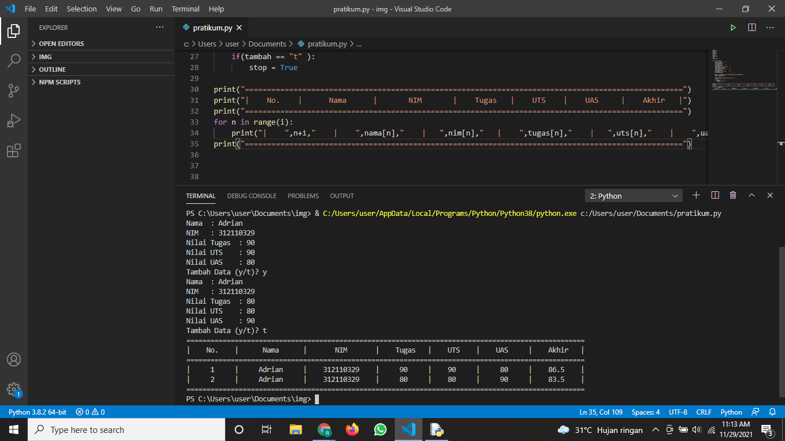
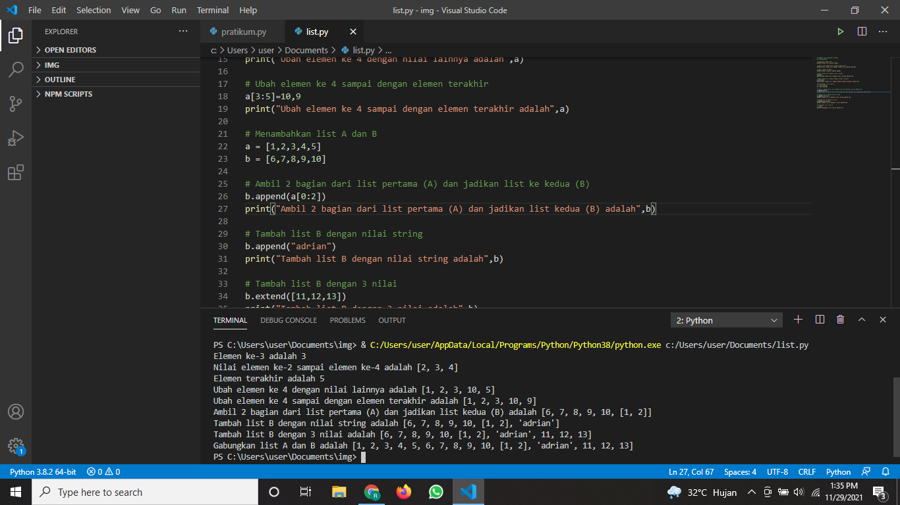

# labspy4
## Latihan 1
# Source Code
```python
nama=[]
nim=[]
tugas=[]
uts=[]
uas=[]
akhir=[]
i=0
stop=False

while not stop:
    n=input("Nama  : ")
    nama.append(n)
    ni=input("NIM   : ")
    nim.append(ni)
    tug=input("Nilai Tugas  : ")
    tugas.append(tug)
    ut=input("Nilai UTS    : ")
    uts.append(ut)
    ua=input("Nilai UAS    : ")
    uas.append(ua)

    akh=(int(tug)*0.30)+(int(ut)*0.35)+(int(ua)*0.35)
    akhir.append(akh)
    
    tambah=input("Tambah Data (y/t)? ")
    i += 1
    if(tambah == "t" ):
        stop = True

print("===================================================================================================")
print("|    No.    |      Nama      |       NIM       |    Tugas   |    UTS    |    UAS     |    Akhir   |")
print("===================================================================================================")
for n in range(i):
    print("|    ",n+1,"    |    ",nama[n],"    |   ",nim[n],"   |    ",tugas[n],"    |   ",uts[n],"    |    ",uas[n],"    |   ",akhir[n],"   |")
print("===================================================================================================")
```
# ScreenShot

## Latihan Membuat List
# Source Code
```python
# Membuat list sebanyak 5 elemen
a = [1,2,3,4,5]

# Tampilkan elemen ke-3
print("Elemen ke-3 adalah",a[2])

# Ambil nilai elemen ke-2 sampai elemen ke-4
print("Nilai elemen ke-2 sampai elemen ke-4 adalah",a[1:4])

# Ambil elemen terakhir
print("Elemen terakhir adalah",a[4])

# Ubah elemen ke 4 dengan nilai lainnya
a[3]=10
print("Ubah elemen ke 4 dengan nilai lainnya adalah",a)

# Ubah elemen ke 4 sampai dengan elemen terakhir
a[3:5]=10,9
print("Ubah elemen ke 4 sampai dengan elemen terakhir adalah",a)

# Menambahkan list A dan B
a = [1,2,3,4,5]
b = [6,7,8,9,10]

# Ambil 2 bagian dari list pertama (A) dan jadikan list ke kedua (B)
b.append(a[0:2])
print("Ambil 2 bagian dari list pertama (A) dan jadikan list kedua (B) adalah",b)

# Tambah list B dengan nilai string
b.append("adrian")
print("Tambah list B dengan nilai string adalah",b)

# Tambah list B dengan 3 nilai
b.extend([11,12,13])
print("Tambah list B dengan 3 nilai adalah",b)

# Gabungkan list A dan B
c = a+b
print("Gabungkan list A dan B adalah",c)
```
# ScreenShot

